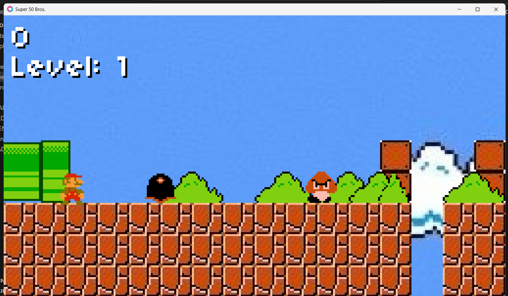
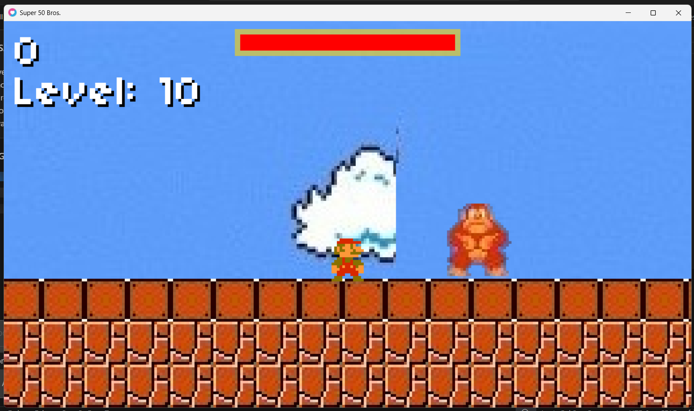

# Super Platformer Fan Project

A retro-style 2D platformer inspired by classic arcade and console platform games.

This project was created for educational and non-commercial purposes using Lua and the LÖVE2D framework.

## Features

- Retro pixel-art gameplay
- Multiple themed levels
- Enemy AI and collision system
- Boss fight with Donkey Kong
- Tile-based world generation
- Classic side-scrolling mechanics
- Keyboard controls



## Technologies Used

- Lua
- LÖVE2D
- Custom game states and sprite systems



## Controls

| Key | Action |
|---|---|
| Arrow Keys | Move |
| Space | Jump |
| Enter | Start / Confirm |
| Escape | Quit |

## Installation

1. Install LÖVE2D:
   https://love2d.org/

2. Clone this repository:

```
bash
git clone https://github.com/IshaanShivalli/your-repo-name.git
```