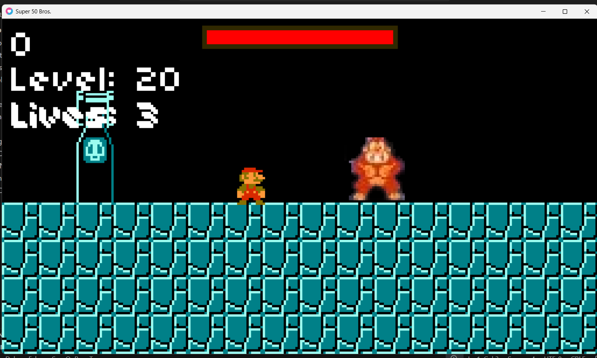
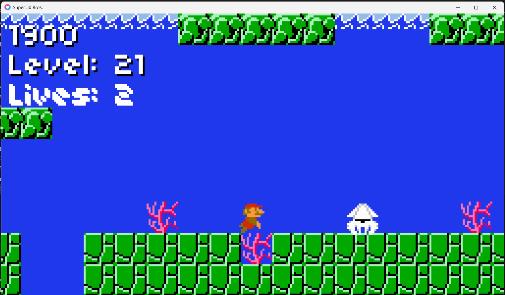
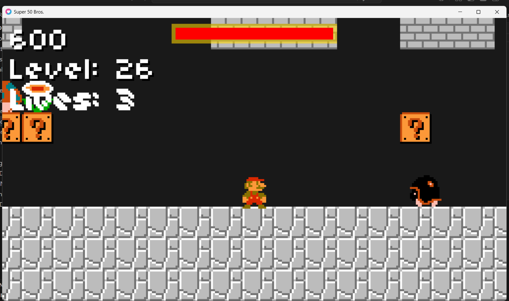
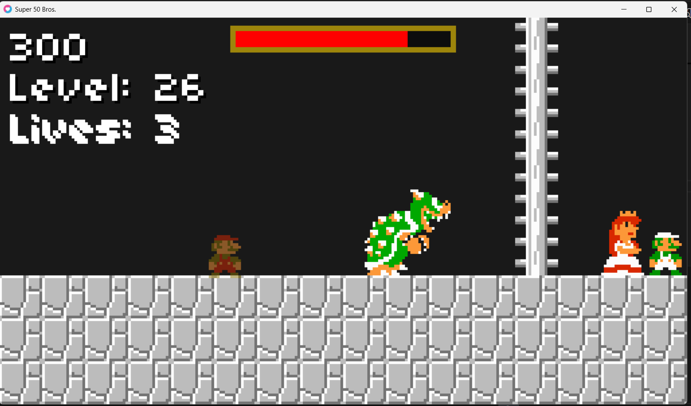

# Super Platformer Bros. Fan Project

A retro-style 2D platformer built with Lua and the LÖVE2D framework, inspired by the classic mechanics of original platforming icons.

This project was created for educational and non-commercial purposes using Lua and the LÖVE2D framework.

## Features

- Retro pixel-art gameplay
- 26 Unique Levels across Overworld, Underground, Underwater, and Castle themes.
- Advanced Enemy AI: Encounter Snails, Goombas, Piranha Plants, Squids, and Fish.
- Epic Boss Encounters: Face off against Donkey Kong and the final boss, Bowser.
- Powerup System: Collect powerups to become Big Mario or Fire Mario.
- Level Progression: Automatically saves and loads your progress from the main menu.
- Classic side-scrolling mechanics
- Cinematic Dialogue sequences for boss encounters and the final victory.

## Technologies Used

- Lua
- LÖVE2D
- Custom State Machine and Sprite Animation systems
- Procedural Level Generation logic







## Controls

| Key | Action |
|---|---|
| Arrow Keys | Move / Swim |
| Space / Up | Jump / Swim Up |
| Z | Throw Fireball (Fire Mario) |
| Enter | Start / Confirm / Skip Dialogue |
| Escape | Quit |

## Installation

1. Install LÖVE2D:
   https://love2d.org/

2. Clone this repository:
```bash
git clone https://github.com/IshaanShivalli/Super_Platformer.git
```